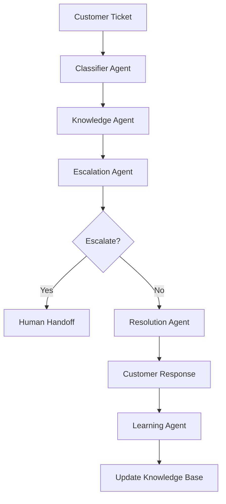

# 🎧 Adaptive Customer Support Resolver

An AI-powered customer support system that uses multi-agent architecture with LangGraph to automatically classify, research, and resolve customer tickets. Built with Google Gemini LLM, MxBai embeddings, and Elasticsearch for vector search.

## 🌟 Features

### 🤖 Multi-Agent Architecture
- **Classifier Agent**: Categorizes and prioritizes tickets
- **Knowledge Agent**: Searches documentation and past solutions  
- **Escalation Agent**: Determines when human intervention is needed
- **Resolution Agent**: Crafts personalized responses
- **Learning Agent**: Updates knowledge base from successful resolutions

### 🔧 Technology Stack
- **LLM**: Google Gemini 1.5 Pro for natural language processing
- **Embeddings**: MxBai Embed Large v1 from Hugging Face
- **Vector Database**: Elasticsearch with vector search capabilities
- **Framework**: LangGraph for workflow orchestration
- **Backend**: FastAPI with async support
- **Frontend**: Streamlit with real-time dashboard
- **Language**: Python 3.8+

### ✨ Key Capabilities
- Real-time ticket processing (< 30 seconds)
- Semantic knowledge base search
- Intelligent escalation routing
- Customer satisfaction tracking
- Analytics dashboard with metrics
- Continuous learning from feedback

## 📁 Project Structure

```
adaptive-customer-support/
├── requirements.txt                    # Python dependencies
├── README.md                          # Project documentation
├── config/
│   └── settings.py                    # Configuration settings
├── backend/
│   ├── main.py                        # FastAPI application
│   ├── agents/                        # AI agents
│   │   ├── classifier_agent.py        # Ticket classification
│   │   ├── knowledge_agent.py         # Knowledge base search
│   │   ├── escalation_agent.py        # Escalation decisions
│   │   ├── resolution_agent.py        # Response generation
│   │   └── learning_agent.py          # Continuous learning
│   ├── services/                      # Core services
│   │   ├── llm_service.py             # Gemini LLM integration
│   │   ├── embedding_service.py       # MxBai embeddings
│   │   └── elasticsearch_service.py   # Vector database
│   ├── models/
│   │   └── schemas.py                 # Pydantic data models
│   └── workflows/
│       └── support_workflow.py       # LangGraph workflow
├── frontend/
│   └── streamlit_app.py               # Web interface
├── data/
│   └── sample_knowledge_base.json     # Sample KB articles
└── scripts/
    ├── setup_elasticsearch.py         # ES setup automation
    └── populate_knowledge_base.py     # KB data loading
```

## 🚀 Quick Start

### Prerequisites
- Python 3.8 or higher
- Java 11+ (for Elasticsearch)
- 4GB+ RAM recommended

### 1. Clone and Setup

```bash
# Clone the repository
git clone <repository-url>
cd adaptive-customer-support

# Create virtual environment
python -m venv venv
source venv/bin/activate  # On Windows: venv\Scripts\activate

# Install dependencies
pip install -r requirements.txt
```

### 2. Environment Configuration

Create a `.env` file in the project root:

```env
# Google AI API Key (Required)
GEMINI_API_KEY=your_gemini_api_key_here

# Elasticsearch Configuration
ELASTICSEARCH_URL=http://localhost:9200
ELASTICSEARCH_INDEX=customer_support_kb

# Optional: Custom settings
TEMPERATURE=0.1
MAX_TOKENS=1000
```

**Get your Gemini API key:**
1. Visit [Google AI Studio](https://makersuite.google.com/app/apikey)
2. Create a new API key
3. Add it to your `.env` file

### 3. Setup Elasticsearch

```bash
# Automated setup (downloads and configures ES)
python scripts/setup_elasticsearch.py

# Start Elasticsearch
./start_elasticsearch.sh  # Linux/Mac
# or
start_elasticsearch.bat   # Windows

# Verify ES is running
curl http://localhost:9200
```

### 4. Populate Knowledge Base

```bash
# Load sample data into Elasticsearch
python scripts/populate_knowledge_base.py
```

### 5. Start the Application

#### Terminal 1 - Backend API:
```bash
python -m uvicorn backend.main:app --reload --port 8000
```

#### Terminal 2 - Frontend UI:
```bash
streamlit run frontend/streamlit_app.py --server.port 8501
```

### 6. Access the Application

- **Web Interface**: http://localhost:8501
- **API Documentation**: http://localhost:8000/docs
- **Health Check**: http://localhost:8000/health

## 💡 Usage Guide

### Customer Portal

1. **Submit Ticket**: Go to "Submit Ticket" tab
   - Fill in subject and detailed message
   - Optionally provide contact information
   - Click "Submit Ticket"

2. **AI Processing**: The system automatically:
   - Classifies the ticket (category, priority)
   - Searches knowledge base for solutions
   - Decides whether to escalate or resolve
   - Generates personalized response

3. **Track Progress**: Use "Track Ticket" tab
   - Enter your ticket ID
   - View status and resolution

4. **Provide Feedback**: Rate the AI response
   - Helps improve future responses
   - Enables continuous learning

### Admin Dashboard

- **Analytics**: View ticket metrics and trends
- **Knowledge Base**: Search existing articles
- **Admin Panel**: Manage system settings

## 🔧 API Endpoints

### Core Endpoints

- `POST /tickets` - Create new ticket
- `POST /tickets/{id}/process` - Process ticket through AI workflow
- `GET /tickets/{id}` - Get ticket details
- `POST /tickets/{id}/feedback` - Submit feedback
- `GET /analytics/dashboard` - Get system metrics
- `GET /knowledge/search` - Search knowledge base

### Example API Usage

```python
import requests

# Create a ticket
ticket_data = {
    "subject": "Can't reset password",
    "message": "I'm unable to reset my password. The reset link doesn't work.",
    "customer_email": "user@example.com"
}

response = requests.post("http://localhost:8000/tickets", json=ticket_data)
ticket_id = response.json()["data"]["ticket_id"]

# Process the ticket
process_response = requests.post(f"http://localhost:8000/tickets/{ticket_id}/process")
result = process_response.json()
```

## 🔍 Architecture Deep Dive

### Multi-Agent Workflow



### Agent Responsibilities

1. **Classifier Agent**
   - Natural language understanding
   - Category classification (technical, billing, account, etc.)
   - Priority assessment (low, medium, high, critical)
   - Confidence scoring

2. **Knowledge Agent**
   - Semantic search using vector embeddings
   - Hybrid search (text + vector)
   - Result ranking and relevance scoring
   - Knowledge article recommendation

3. **Escalation Agent**
   - Rule-based and AI-powered escalation logic
   - Sentiment analysis for customer frustration
   - Complexity assessment
   - Routing to appropriate specialists

4. **Resolution Agent**
   - Context-aware response generation
   - Knowledge base integration
   - Personalization based on customer data
   - Multi-format response support

5. **Learning Agent**
   - Feedback analysis and processing
   - Knowledge base updates
   - Performance metric tracking
   - Continuous improvement recommendations

### Data Flow

1. **Ticket Ingestion**: Customer submits ticket via web interface
2. **Classification**: AI categorizes and prioritizes the issue
3. **Knowledge Retrieval**: Vector search finds relevant solutions
4. **Decision Making**: System decides on escalation vs. AI resolution
5. **Response Generation**: Personalized response created using LLM
6. **Feedback Loop**: Customer feedback improves future responses

## 📊 Performance Metrics

### Response Times
- **AI Classification**: < 3 seconds
- **Knowledge Search**: < 2 seconds  
- **Response Generation**: < 5 seconds
- **Total Processing**: < 30 seconds

### Accuracy Targets
- **Classification Accuracy**: > 85%
- **Knowledge Relevance**: > 80%
- **Customer Satisfaction**: > 75%
- **Escalation Precision**: > 90%

## 🛠️ Development

### Adding New Knowledge Articles

```python
# Use the API to add articles
article_data = {
    "id": "kb-new-001",
    "title": "How to Update Profile Information",
    "content": "Step-by-step guide...",
    "category": "account",
    "tags": ["profile", "update", "account"]
}

# Generate embedding and add to ES
embedding = await embedding_service.create_document_embedding(
    f"{article_data['title']}. {article_data['content']}"
)
await es_service.add_knowledge_article(article, embedding)
```

### Extending Agents

Each agent is modular and can be extended:

```python
# Example: Adding new classification categories
class ExtendedClassifierAgent(ClassifierAgent):
    def __init__(self):
        super().__init__()
        self.custom_categories = ["refund", "feature_request"]
    
    async def classify_ticket(self, ticket):
        # Custom classification logic
        result = await super().classify_ticket(ticket)
        # Add custom processing
        return result
```

### Custom Workflows

Create new workflows using LangGraph:

```python
from langgraph.graph import StateGraph

def create_custom_workflow():
    workflow = StateGraph(CustomState)
    workflow.add_node("custom_step", custom_function)
    workflow.add_edge("start", "custom_step")
    return workflow.compile()
```

## 🧪 Testing

### Run Tests

```bash
# Unit tests
python -m pytest tests/unit/

# Integration tests  
python -m pytest tests/integration/

# End-to-end tests
python -m pytest tests/e2e/
```

### Manual Testing

1. **Health Check**: Visit `/health` endpoint
2. **Sample Tickets**: Use provided test cases
3. **Knowledge Search**: Test vector similarity
4. **Escalation Logic**: Test edge cases

## 📈 Monitoring & Analytics

### Key Metrics Dashboard

- Total tickets processed
- Average resolution time
- Customer satisfaction scores
- Escalation rates by category
- Knowledge base utilization
- Agent performance metrics

### Logs and Debugging

```bash
# View application logs
tail -f logs/app.log

# Elasticsearch logs
tail -f elasticsearch/logs/customer-support-dev.log

# FastAPI debug mode
uvicorn backend.main:app --reload --log-level debug
```

## 🔒 Security Considerations

### API Security
- Input validation using Pydantic models
- Rate limiting on API endpoints
- CORS configuration for frontend
- Environment variable protection

### Data Privacy
- No sensitive data stored in embeddings
- Customer data anonymization options
- GDPR compliance features
- Secure deletion capabilities

## 🚀 Production Deployment

### Environment Setup

1. **Database**: Use managed Elasticsearch service
2. **API Keys**: Secure key management system
3. **Scaling**: Container orchestration
4. **Monitoring**: Application performance monitoring
5. **Backup**: Regular data backups

### Performance Optimization

- **Caching**: Redis for frequent queries
- **Load Balancing**: Multiple API instances
- **Database**: Elasticsearch cluster setup
- **CDN**: Static asset delivery

## 🤝 Contributing

1. Fork the repository
2. Create feature branch (`git checkout -b feature/amazing-feature`)
3. Commit changes (`git commit -m 'Add amazing feature'`)
4. Push to branch (`git push origin feature/amazing-feature`)
5. Open Pull Request

### Code Style

- Follow PEP 8 for Python code
- Use type hints for all functions
- Add docstrings for public methods
- Write tests for new features

## 📄 License

This project is licensed under the MIT License - see the [LICENSE](LICENSE) file for details.

## 🆘 Support

### Common Issues

**Q: Elasticsearch connection refused**
A: Ensure Elasticsearch is running on port 9200. Check with `curl localhost:9200`

**Q: Gemini API errors**
A: Verify your API key in the `.env` file and check your quota

**Q: Embedding model download fails**
A: Check internet connection and available disk space (model is ~1GB)

**Q: Frontend won't connect to backend**
A: Ensure FastAPI is running on port 8000 and CORS is configured

### Getting Help

- 📧 Create an issue on GitHub
- 💬 Check existing issues and discussions
- 📖 Review the documentation
- 🔍 Search Stack Overflow with tag `customer-support-ai`

## 🎯 Roadmap

### Version 2.0 Features
- [ ] Multi-language support
- [ ] Voice/audio ticket processing
- [ ] Advanced analytics with ML insights
- [ ] Custom agent training
- [ ] Integration with popular helpdesk platforms
- [ ] Mobile app for agents
- [ ] Real-time chat interface
- [ ] Advanced security features

### Performance Improvements
- [ ] Response time optimization
- [ ] Better caching strategies
- [ ] Database query optimization
- [ ] Async processing improvements

---

**Built with ❤️ for better customer support experiences**