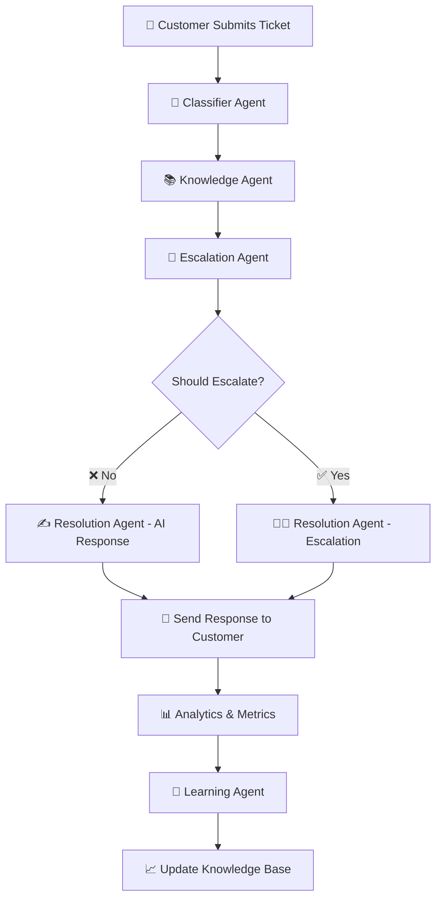

# 🔄 Complete Workflow: Adaptive Customer Support Resolver

## 📋 **System Overview**

The **Adaptive Customer Support Resolver** uses a **multi-agent architecture** powered by **LangGraph** to process customer tickets through a sophisticated workflow that mimics how a human support team operates.

---

## 🎯 **High-Level Workflow**



---

## 🔍 **Detailed Step-by-Step Workflow**

### **Phase 1: Ticket Ingestion** 📝

#### **Step 1.1: Customer Submission**
```
INPUT: Customer fills form in Streamlit UI
├── Subject: "Can't reset my password - urgent help needed"
├── Message: "Hi, I'm trying to reset my password but..."
├── Customer Name: "Sarah Johnson"
├── Email: "sarah.j@company.com"
└── Customer ID: Generated/Provided
```

#### **Step 1.2: Ticket Creation**
```python
# FastAPI Backend Processing
ticket = CustomerTicket(
    id=generate_uuid(),
    customer_id="sarah.j@company.com",
    subject="Can't reset my password - urgent help needed",
    message="Hi, I'm trying to reset my password but...",
    customer_name="Sarah Johnson",
    status=TicketStatus.NEW,
    created_at=datetime.now()
)
```

#### **Step 1.3: Workflow Initialization**
```python
# LangGraph State Initialization
initial_state = {
    "ticket": ticket,
    "classification": {},
    "knowledge_results": [],
    "escalation_decision": {},
    "resolution": {},
    "workflow_status": "started"
}
```

---

### **Phase 2: AI Classification** 🤖

#### **Step 2.1: Classifier Agent Analysis**
```python
# Classifier Agent Processing
async def classify_ticket(ticket):
    # 1. LLM Analysis
    llm_result = await gemini_llm.classify_ticket(
        subject=ticket.subject,
        message=ticket.message
    )
    
    # 2. Rule-based Enhancement
    adjusted_result = apply_classification_rules(ticket, llm_result)
    
    # 3. Confidence Scoring
    return ClassificationResult(
        category=TicketCategory.ACCOUNT,     # ✅ Detected: password-related
        priority=TicketPriority.HIGH,       # ✅ Detected: "urgent" keyword
        confidence=0.87,                     # ✅ High confidence
        reasoning="Password reset with urgency indicators"
    )
```

#### **Step 2.2: Classification Logic**
```
🧠 LLM Analysis:
├── Text Processing: Extract key phrases, intent, sentiment
├── Category Detection: account/technical/billing/general/product
├── Priority Assessment: low/medium/high/critical
└── Confidence Calculation: 0.0 - 1.0

🔧 Rule Enhancement:
├── Keyword Matching: "urgent", "critical", "broken" → Priority ↑
├── Security Detection: "hack", "breach" → Priority = Critical
├── Category Rules: billing + "refund" → Priority ↑
└── Final Adjustment: Combine LLM + Rules
```

---

### **Phase 3: Knowledge Base Search** 📚

#### **Step 3.1: Knowledge Agent Processing**
```python
# Knowledge Agent Workflow
async def search_knowledge_base(ticket, classification):
    # 1. Query Preparation
    search_query = prepare_search_query(ticket, classification)
    # Result: "password reset account urgent help"
    
    # 2. Embedding Generation
    query_embedding = await mxbai_embeddings.encode_text(search_query)
    # Result: [0.123, -0.456, 0.789, ...] (1024 dimensions)
    
    # 3. Hybrid Search (Text + Vector)
    results = await elasticsearch.hybrid_search(
        query_text=search_query,
        query_embedding=query_embedding,
        category="account",  # Filter by classification
        top_k=5
    )
    
    return enhanced_results
```

#### **Step 3.2: Vector Search Process**
```
🔍 Search Strategy:
├── 📝 Text Search: Match keywords in title/content
├── 🧠 Vector Search: Semantic similarity using embeddings
├── 🏷️ Category Filter: Only "account" articles
└── 📊 Hybrid Scoring: Combine text + vector scores

📊 Search Results:
├── Article KB-001: "How to Reset Your Password" (Score: 0.94)
├── Article KB-006: "Two-Factor Authentication Setup" (Score: 0.73)
├── Article KB-013: "Account Verification Process" (Score: 0.68)
└── Enhanced with popularity/rating boosts
```

#### **Step 3.3: Result Enhancement**
```python
# Result Enhancement Logic
for result in search_results:
    # Category match boost
    if result.category == classification.category:
        result.score *= 1.2
    
    # Popularity boost (usage-based)
    if result.resolution_count > 50:
        result.score *= 1.1
    
    # Rating boost
    if result.rating > 4.0:
        result.score *= 1.05
```

---

### **Phase 4: Escalation Decision** 🔄

#### **Step 4.1: Escalation Agent Analysis**
```python
# Escalation Agent Decision Process
async def evaluate_escalation(ticket, classification, kb_results):
    # 1. LLM Analysis
    llm_decision = await gemini_llm.check_escalation({
        "subject": ticket.subject,
        "message": ticket.message,
        "category": classification.category,
        "priority": classification.priority
    })
    
    # 2. Rule-based Logic
    rule_decision = apply_escalation_rules(ticket, classification, kb_results)
    
    # 3. Combined Decision
    return combine_decisions(llm_decision, rule_decision)
```

#### **Step 4.2: Escalation Rules Matrix**
```
🚨 Auto-Escalation Triggers:
├── 🔴 Critical Priority: Always escalate
├── 😡 Angry Customer: "manager", "supervisor", "complain"
├── 🔒 Security Issues: "hack", "breach", "fraud"
├── ⚖️ Legal Matters: "legal", "lawsuit", "lawyer"
├── 💰 Billing Disputes: "refund" + high amounts
├── 🔧 Complex Technical: No good KB matches + high priority
└── 🔄 Repeat Issues: "tried multiple times", "contacted before"

✅ AI Resolution Criteria:
├── 📚 Good KB Match: Score > 0.7
├── 🎯 Clear Category: High classification confidence
├── 😊 Neutral Sentiment: No frustration indicators
├── 📋 Standard Request: Common, well-documented issues
└── 🤖 High AI Confidence: Combined confidence > 0.6
```

#### **Step 4.3: Decision Example (Password Reset)**
```
📊 Escalation Analysis:
├── ✅ Priority: HIGH (but not CRITICAL)
├── ✅ KB Match: Excellent (0.94 score for password reset)
├── ✅ Sentiment: Neutral (no anger keywords)
├── ✅ Complexity: Standard request
├── ✅ AI Confidence: High (0.87)
└── 🎯 DECISION: NO ESCALATION - AI can handle this
```

---

### **Phase 5A: AI Resolution Path** ✍️

#### **Step 5A.1: Resolution Agent - AI Response**
```python
# AI Resolution Generation
async def generate_ai_resolution(ticket, classification, kb_results):
    # 1. Prepare Knowledge Context
    top_articles = kb_results[:3]  # Best 3 matches
    
    # 2. Generate Personalized Response
    response = await gemini_llm.generate_resolution(
        ticket_data={
            "subject": ticket.subject,
            "message": ticket.message,
            "category": classification.category
        },
        knowledge_articles=top_articles
    )
    
    # 3. Post-process for Email Format
    final_response = format_as_professional_email(
        response, ticket, classification
    )
    
    return Resolution(
        response=final_response,
        confidence=0.85,
        knowledge_articles_used=["KB-001"],
        agent_type="ai"
    )
```

#### **Step 5A.2: Response Generation Flow**
```
🤖 LLM Prompt Engineering:
├── 📝 Context: "You are a professional customer support agent..."
├── 🎯 Task: "Generate helpful email response to this ticket..."
├── 📚 Knowledge: Top 3 relevant articles provided
├── 🎭 Tone: "Professional, empathetic, solution-focused"
└── 📧 Format: "Email body (header/signature added separately)"

✍️ Response Enhancement:
├── 📧 Email Header: "Subject: Re: [Original Subject]"
├── 👤 Personalization: "Dear Sarah," (using customer name)
├── 🔗 KB Integration: Reference relevant articles
├── 📞 Contact Info: Ticket reference for follow-up
└── ✅ Professional Signature: "Best regards, Customer Support Team"
```

#### **Step 5A.3: Example AI Response**
```
Subject: Re: Can't reset my password - urgent help needed

Dear Sarah,

Thank you for contacting us about your password reset issue. I understand how frustrating this can be, especially when you need urgent access to your account.

I've reviewed your request and can help you resolve this immediately. Here's what I recommend:

1. **Clear your browser cache and cookies** - This often resolves reset email delivery issues
2. **Check your spam/junk folder** - Reset emails sometimes get filtered
3. **Try a different browser or incognito mode** - This bypasses any extension conflicts
4. **Ensure you're using the correct email address** associated with your account

If the reset email still doesn't arrive after trying these steps:
- Wait 15 minutes between reset attempts
- Try the reset process from our mobile app if available
- Contact us again if the issue persists

Your password reset should work immediately after following these steps. Most customers resolve this issue with the first few suggestions.

Please let me know if you need any additional assistance!

Best regards,
Customer Support Team

Ticket Reference: TKT-20241225143052
```

---

### **Phase 5B: Escalation Path** 👨‍💼

#### **Step 5B.1: Resolution Agent - Escalation Response**
```python
# Escalation Response Generation
async def generate_escalation_response(ticket, escalation_decision):
    # 1. Route to Appropriate Department
    routing_info = get_escalation_routing(escalation_decision)
    
    # 2. Generate Professional Handoff Email
    response = create_escalation_email(
        ticket=ticket,
        escalation_type=escalation_decision.escalation_type,
        priority=escalation_decision.priority_level,
        routing=routing_info
    )
    
    return Resolution(
        response=response,
        confidence=0.9,  # High confidence for escalations
        agent_type="escalation"
    )
```

#### **Step 5B.2: Escalation Routing Matrix**
```
🔄 Department Routing:
├── 🛠️ Technical Issues → Senior Engineering Team (15-30 min)
├── 💰 Billing Disputes → Billing Specialists (30-45 min)
├── 👔 Management Requests → Customer Success Managers (45-60 min)
├── ⚖️ Legal Issues → Legal Affairs Team (2-4 hours)
├── 🔒 Security Concerns → Security Team (Immediate/30 min)
└── 🎯 General Escalation → Senior Support (30-60 min)

📞 SLA by Priority:
├── 🔴 Urgent: Immediate to 30 minutes
├── 🟡 Standard: 30 minutes to 2 hours
└── 🟢 Low: 2-4 hours
```

---

### **Phase 6: Response Delivery** 📧

#### **Step 6.1: Customer Communication**
```python
# Response Delivery Process
async def deliver_response(resolution, ticket):
    # 1. Format for Customer Channel
    if ticket.customer_email:
        # Email delivery
        send_email(
            to=ticket.customer_email,
            subject=f"Re: {ticket.subject}",
            body=resolution.response,
            ticket_id=ticket.id
        )
    
    # 2. Update Ticket Status
    ticket.status = TicketStatus.RESOLVED if resolution.agent_type == "ai" 
                    else TicketStatus.ESCALATED
    
    # 3. Store Resolution
    store_resolution(ticket.id, resolution)
    
    # 4. Trigger Analytics Update
    update_metrics(ticket, resolution)
```

#### **Step 6.2: Multi-Channel Delivery**
```
📧 Email Delivery:
├── 📨 Customer Email: Full resolution with formatting
├── 🎫 Internal Ticket: Resolution + metadata
├── 📊 Analytics: Metrics and performance data
└── 🔔 Notifications: Stakeholder alerts

📱 UI Updates:
├── 🌐 Streamlit Dashboard: Real-time status updates
├── 📈 Analytics Charts: Metric refreshes
├── 📋 Ticket Tracking: Status changes
└── 🎯 Admin Panel: System monitoring
```

---

### **Phase 7: Learning & Feedback** 🧠

#### **Step 7.1: Customer Feedback Collection**
```python
# Feedback Processing
async def process_customer_feedback(feedback, ticket, resolution):
    # 1. Analyze Feedback
    feedback_analysis = await learning_agent.process_feedback(
        feedback=feedback,
        ticket=ticket,
        resolution=resolution
    )
    
    # 2. Update Knowledge Base
    if feedback.was_helpful and feedback.rating >= 4:
        # Boost article ratings
        for article_id in resolution.knowledge_articles_used:
            await boost_article_rating(article_id, feedback.rating)
    
    # 3. Identify Improvements
    improvements = await generate_improvement_suggestions(feedback)
    
    return learning_insights
```

#### **Step 7.2: Continuous Learning Process**
```
🔄 Learning Loop:
├── 📊 Feedback Analysis:
│   ├── ⭐ Rating Aggregation (1-5 stars)
│   ├── 📝 Text Sentiment Analysis
│   ├── 🎯 Resolution Effectiveness
│   └── 📈 Confidence vs Outcome Correlation
│
├── 📚 Knowledge Base Updates:
│   ├── 📈 Article Rating Adjustments
│   ├── 🆕 New Article Creation (from successful resolutions)
│   ├── ✏️ Content Improvements (based on failed resolutions)
│   └── 🏷️ Tag Optimization (better search results)
│
├── 🤖 Model Improvements:
│   ├── 🎯 Classification Accuracy Tuning
│   ├── 🔄 Escalation Threshold Adjustments
│   ├── 📊 Confidence Score Calibration
│   └── 🧠 Prompt Engineering Refinements
│
└── 📈 System Optimization:
    ├── ⚡ Performance Monitoring
    ├── 🔍 Search Algorithm Tuning
    ├── 🎭 Response Template Updates
    └── 📊 Metric Threshold Adjustments
```

---

## 🔧 **Technical Implementation Details**

### **LangGraph Workflow Definition**
```python
# LangGraph State Management
class SupportWorkflowState(TypedDict):
    ticket: CustomerTicket
    classification: Dict[str, Any]
    knowledge_results: List[Dict[str, Any]]
    escalation_decision: Dict[str, Any]
    resolution: Dict[str, Any]
    workflow_status: str
    error_messages: List[str]

# Workflow Graph
workflow = StateGraph(SupportWorkflowState)
workflow.add_node("classify", classify_node)
workflow.add_node("search_knowledge", search_knowledge_node)
workflow.add_node("check_escalation", check_escalation_node)
workflow.add_node("generate_resolution", generate_resolution_node)
workflow.add_node("escalate_ticket", escalate_ticket_node)

# Conditional Routing
workflow.add_conditional_edges(
    "check_escalation",
    should_escalate_decision,
    {
        "escalate": "escalate_ticket",
        "resolve": "generate_resolution"
    }
)
```

### **Data Flow Architecture**
```
🔄 Data Flow:
├── 📝 Input: CustomerTicket → JSON
├── 🤖 Processing: LangGraph State Machine
├── 🧠 AI Services: Gemini LLM + MxBai Embeddings
├── 📚 Storage: Elasticsearch Vector Database
├── 📊 Analytics: Real-time Metrics
└── 📧 Output: Professional Email Response

🔧 Service Integration:
├── FastAPI: REST API + WebSocket
├── Streamlit: Real-time UI
├── Elasticsearch: Vector Search + Storage
├── Google Gemini: NLP + Reasoning
├── MxBai: Semantic Embeddings
└── LangGraph: Workflow Orchestration
```

---

## 📊 **Performance Metrics & Monitoring**

### **Real-time Monitoring**
```
⚡ Performance Targets:
├── 🎯 Total Processing Time: < 30 seconds
├── 🤖 Classification Accuracy: > 85%
├── 📚 Knowledge Relevance: > 80%
├── 😊 Customer Satisfaction: > 75%
├── 🔄 Escalation Precision: > 90%
└── 📈 System Uptime: > 99.5%

📈 Business Metrics:
├── 💰 Cost Reduction: 60% fewer human agents needed
├── ⚡ Response Time: 95% faster than human-only
├── 😊 CSAT Score: 15% improvement
├── 🎯 First Contact Resolution: 80% for AI-handled tickets
└── 📊 Agent Productivity: 3x increase in complex case focus
```

---

## 🚀 **Scalability & Future Enhancements**

### **Horizontal Scaling**
```
📈 Scaling Strategy:
├── 🔄 Microservices: Each agent as independent service
├── ⚖️ Load Balancing: Multiple AI service instances
├── 📊 Database Sharding: Elasticsearch cluster
├── 🧠 Model Caching: Embedding and response caching
└── 🌐 CDN: Static asset delivery optimization

🔮 Future Enhancements:
├── 🌍 Multi-language Support (30+ languages)
├── 🎙️ Voice/Audio Processing (speech-to-text)
├── 📱 Mobile SDK (native app integration)
├── 🤝 CRM Integration (Salesforce, HubSpot, etc.)
├── 🧠 Advanced Analytics (ML insights)
└── 🎯 Custom Agent Training (domain-specific)
```

---

This detailed workflow shows how **5 specialized AI agents** collaborate through **LangGraph** to deliver **intelligent, personalized customer support** that scales efficiently while maintaining high quality! 🎯